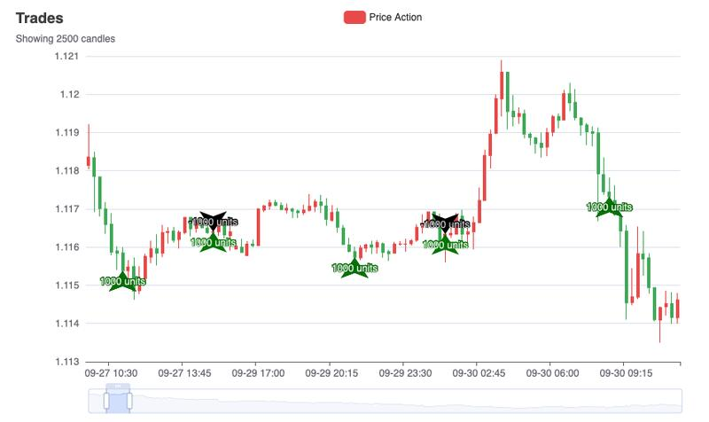
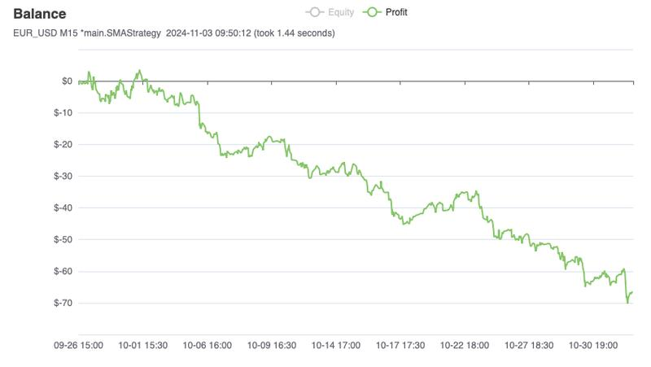
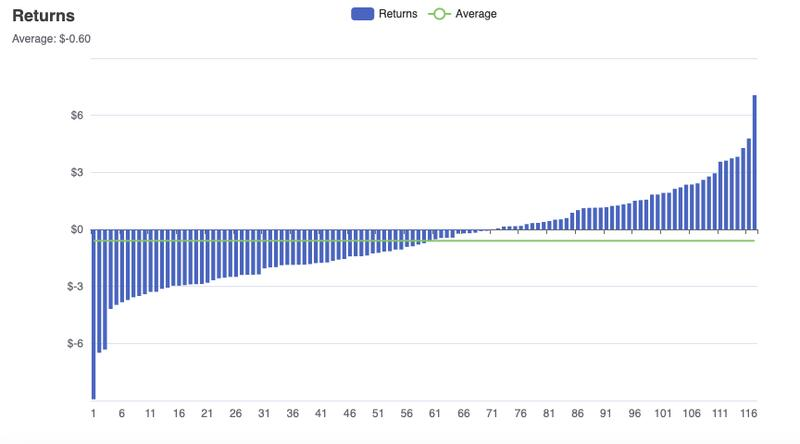

# autotrader

> [WARNING]: There are still many bugs to be fixed, this software is not ready to be used for live trading. PRs and bug fixes welcome!
>
> If you still feel like importing the library into your project, I highly recommend vendoring it (copying it directly to the folder).

Autotrader is a forex quantitative trading engine I developed in two weeks using Go. The unique backtesting simulations runs a user-designed trading algorithm against historical market data. The simulation accounts for brokerage fees, hedging, leverage, market orders, limit orders, stop orders, and more. Once a reliable strategy has been identified, the user can run the trading algorithm they created on their live brokerage account.

Autotrader inserts layers of abstraction all the way down from the implementation of the trading strategy to the orders and positions maintained by the brokers over their JSON REST APIs. All financial algorithms and data structures used in this project were developed from scratch, including a time series table inspired by the NumPy Python data science library.

The following page is a report generated by Autotrader when backtesting a naive SMA crossover strategy using realtime Forex market data:

## License

Zero-clause BSD (0BSD)
